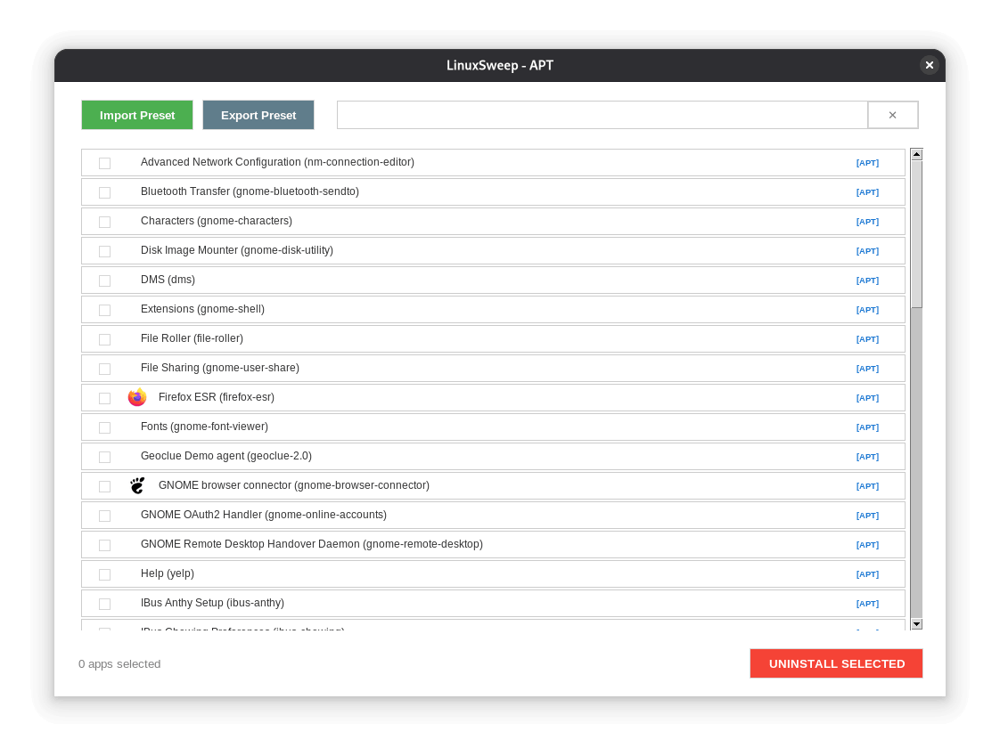

# 🧹 LinuxSweep

**The ultimate high-density, surgical debloater for Linux distributions.**

LinuxSweep is a lightweight, professional GUI utility designed to help you reclaim your system by purging unwanted pre-installed applications and Flatpaks. Built with a focus on speed and a clean, high-density interface, it allows you to "sweep" your distro clean in seconds.

---

## ✨ Key Features

* **🚀 Cross-Distro Support:** Seamlessly works with **APT**, **DNF**, **Pacman**, and **Zypper**.
* **📦 Flatpak Integration:** Automatically detects and uninstalls Flatpak applications alongside native packages.
* **🔍 Search:** A unit-styled, borderless flexible search bar with auto-unfocus logic.
* **💾 Preset Management:** Import and Export your custom debloat lists as `.json` files to replicate your perfect setup on any machine.
* **⚡ Instant UX:** Selective row redrawing for a smooth, flicker-free experience.

---



---

## 🛠️ Requirements

To run LinuxSweep, ensure you have the following dependencies installed (the script will attempt to install them for you if missing):

* **Python 3**
* **Tkinter** (Python GUI library)
* **Pillow** (Python Imaging Library for icons)

---

## 🚀 Installation & Usage

### ⚡ Quick Start (Run Instantly)
Run LinuxSweep immediately without cloning the repository:
```bash
curl -fsSL https://raw.githubusercontent.com/CodeWithAlamin/LinuxSweep/refs/heads/main/linux_sweep.sh | bash
````

### 🛠️ Standard Installation

1.  **Clone the repository:**

    ```bash
    git clone https://github.com/CodeWithAlamin/LinuxSweep.git
    cd LinuxSweep
    chmod +x linux_sweep.sh
    sudo ./linux_sweep.sh
    ```

2.  **Make the script executable:**

    ```bash
    chmod +x linux_sweep.sh
    ```

3.  **Run it:**

    ```bash
    ./linux_sweep.sh
    ```

    *Note: The app uses Polkit (pkexec) to ask for your password via a standard system pop-up for necessary root actions.*

-----

## 📂 Presets

LinuxSweep uses a simple JSON format for presets. This makes it easy to share your "Debloat Lists" with the community.

**Example `debloat.json`:**

```json
[
    "gnome-weather",
    "org.gnome.Maps",
    "cheese"
]
```

When importing, LinuxSweep automatically scans your system and selects only the apps that are actually installed, providing a summary notification upon completion.

-----

## 🤝 Contributing

Contributions are welcome\! If you have ideas for new features or UI improvements, feel free to open an issue or submit a pull request.

-----

## 👨‍💻 Developed By

**Alamin**

- **GitHub:** [@CodeWithAlamin](https://github.com/CodeWithAlamin)
- **LinkedIn:** [CodeWithAlamin](https://www.linkedin.com/in/CodeWithAlamin)
- **X (Twitter):** [@CodeWithAlamin](https://x.com/CodeWithAlamin)

-----

**Sweep your Linux system clean with LinuxSweep\!** 🐧✨
